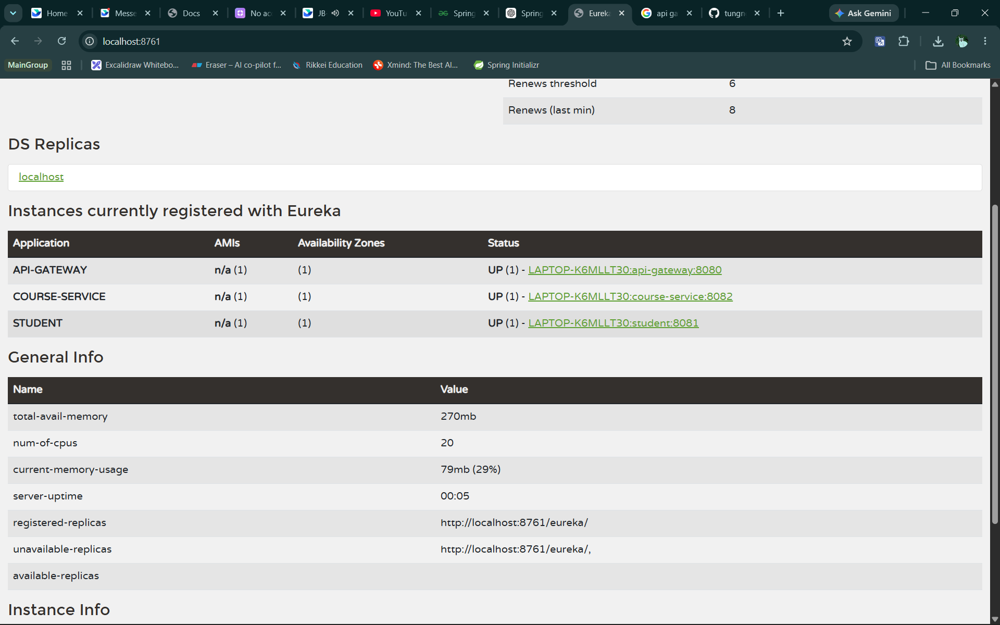
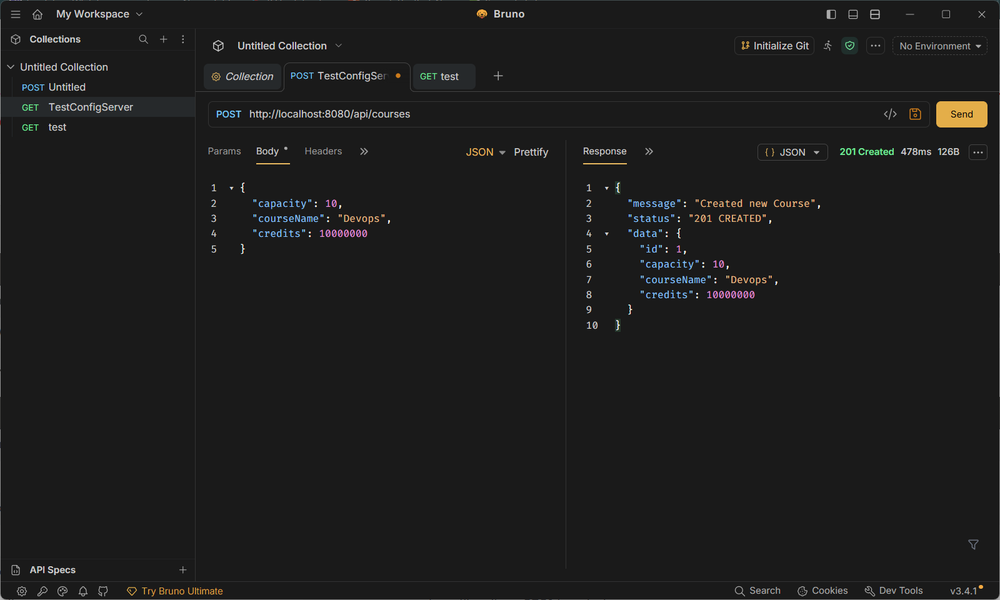
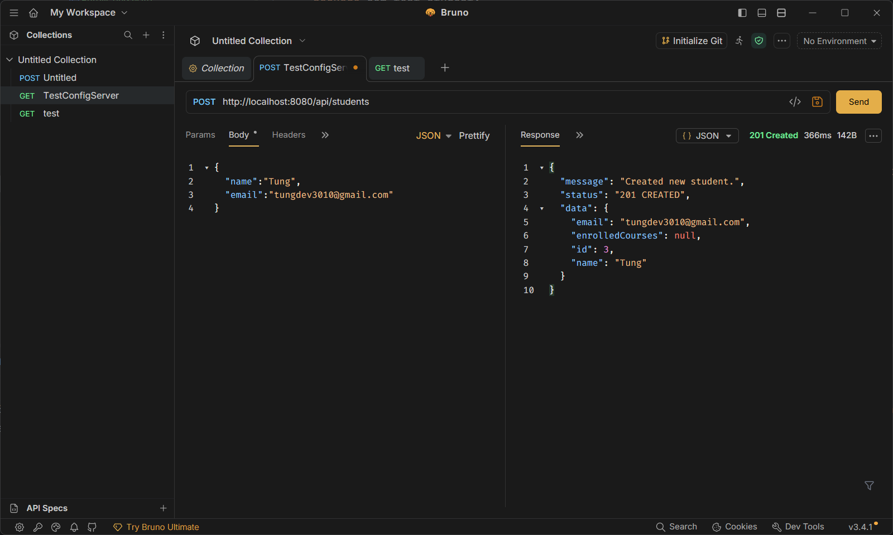
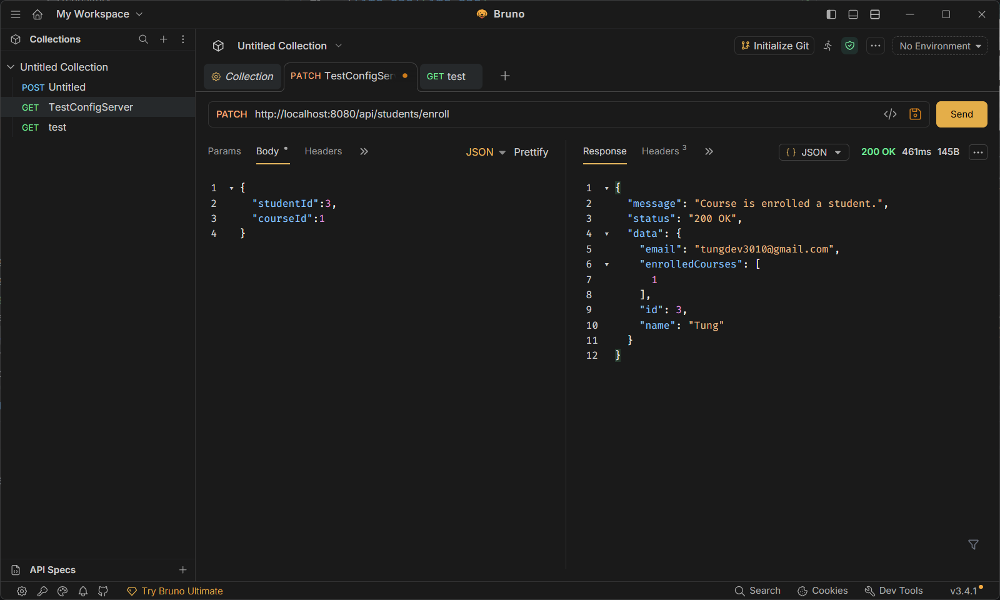

### Task 3
Giải thích cơ chế "Service Discovery": Tại sao Gateway không nên gọi trực tiếp địa chỉ IP/Port của Service?
- Với cơ chế của Service Discorvery, mọi service đăng ký bên trong eureka server sẽ xuất hiện với tên service đã được thiết lập, từ đó chúng sử dụng lb:\ + tên service xuất hiện trên eureka. Api gateway sẽ thông qua service đã đăng ký trong eureka service để có thể routing.
- Gateway không nên gọi trực tiếp địa chỉ IP/Port, vì chúng sẽ luôn thay đổi sau khi khởi động lại thiết bị, những thông tin này cần được bảo mật an toàn.
Nếu số lượng request tăng đột biến, bạn sẽ làm gì để mở rộng (Scale) Student Service mà không làm thay đổi cấu hình của Gateway?
- Nếu số lượng request tăng đột biết, mình có thể tăng số lượng Student Service lên và khởi chạy trên các port khác nhau ví dụ 8085 8086. Sau đó cấu hình các Student Service đó lên eureka server. Với cơ chế loadbalance thì api gateway sẽ được eureka hỗ trợ điều phối công việc routing đến các Student service khác rảnh rỗi, điều này giúp hệ thống scale lên được mà không cần phải thay đổi cấu hình của Api Gateway.

So sánh ưu/nhược điểm của phương thức giao tiếp qua Open Feign (Đồng bộ) so với Kafka (Bất đồng bộ) trong bài toán này.

Open Feign
Ưu điểm:

Bài toán đơn giản dễ dàng cấu hình và triển khai
Dữ liệu tức thời (Strong Consistency): Tại thời điểm học sinh bấm "Đặt hàng", bạn biết chắc chắn sản phẩm có còn hàng hay không, giá cả có chính xác không để trả về kết quả Thành công hoặc Thất bại ngay trên màn hình. Nhược điểm:
Hiệu năng và sức chịu tải kém: Nếu hệ thống có 1000 học sinh cùng đặt hàng, 1000 request của Student-Service sẽ phải "đứng im xếp hàng" chờ Product-Service phản hồi. Nếu Product-Service xử lý chậm, Student-Service sẽ cạn kiệt thread và sập theo.
Kafka
Ưu điểm:

Độc lập các service: điều này đảm bảo hệ thống luôn hoạt động kể cả khi 1 trong các service gặp vế đề về internet, service unavailable. Student service cứ gửi thông báo lên cho kafka, chúng ta có thể trả message thân thiện ngay khi Product Service gặp vấn đề. Ngay sau khi Product Service sống lại thì sẽ được kafka gửi message tới.

Tính chịu tải cao: Kafka có thể tiếp nhận hàng trăm nghìn tin nhắn mỗi giây. Nó giúp bóc tách các tác vụ nặng (như trừ kho, gửi email xác nhận, tạo hóa đơn) ra khỏi luồng chính của học sinh. Nhược điểm:

Dữ liệu nhất quán sau: Bạn không thể trả về chữ "Đặt hàng thành công" ngay lập tức cho khách. Thay vào đó phải hiển thị trạng thái "Đang xử lý". Nếu sau đó kiểm tra kho bị hết hàng, bạn phải gửi thông báo/email để hủy đơn của khách sau (Logic xử lý rollback - Saga Pattern rất phức tạp).
